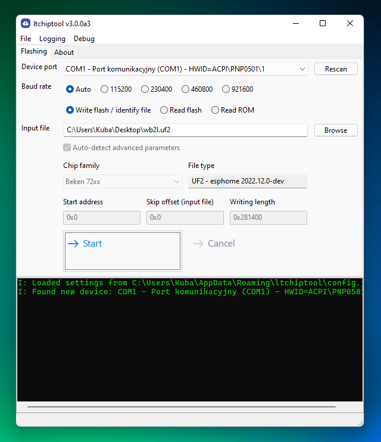

# ltchiptool

Universal, easy-to-use GUI flashing/dumping tool for BK7231, RTL8710B and RTL8720C. Also contains some CLI utilities for binary firmware manipulation.

<div align="center">

[](https://github.com/psf/black)
[](https://pypi.org/project/ltchiptool/)

[](https://github.com/libretuya/ltchiptool/releases/latest)


</div>

## What is this?

This repository is a collection of tools, used in the [LibreTuya project](https://github.com/kuba2k2/libretuya), that perform some chip-specific tasks, like packaging binary images or uploading firmware to the chip.

Since v2.0.0, it contains a common, chip-independent CLI and API for interacting with supported chips in download mode (reading/writing flash).

Since v3.0.0, it contains a beginner-friendly GUI for flashing firmware or dumping flash contents.

# Usage/documentation
<div style="text-align: center">

## [Available here](https://docs.libretuya.ml/docs/flashing/tools/ltchiptool/)
</div>

## License

```
MIT License

Copyright (c) 2022 Kuba Szczodrzyński

Permission is hereby granted, free of charge, to any person obtaining a copy
of this software and associated documentation files (the "Software"), to deal
in the Software without restriction, including without limitation the rights
to use, copy, modify, merge, publish, distribute, sublicense, and/or sell
copies of the Software, and to permit persons to whom the Software is
furnished to do so, subject to the following conditions:

The above copyright notice and this permission notice shall be included in all
copies or substantial portions of the Software.

THE SOFTWARE IS PROVIDED "AS IS", WITHOUT WARRANTY OF ANY KIND, EXPRESS OR
IMPLIED, INCLUDING BUT NOT LIMITED TO THE WARRANTIES OF MERCHANTABILITY,
FITNESS FOR A PARTICULAR PURPOSE AND NONINFRINGEMENT. IN NO EVENT SHALL THE
AUTHORS OR COPYRIGHT HOLDERS BE LIABLE FOR ANY CLAIM, DAMAGES OR OTHER
LIABILITY, WHETHER IN AN ACTION OF CONTRACT, TORT OR OTHERWISE, ARISING FROM,
OUT OF OR IN CONNECTION WITH THE SOFTWARE OR THE USE OR OTHER DEALINGS IN THE
SOFTWARE.

```
